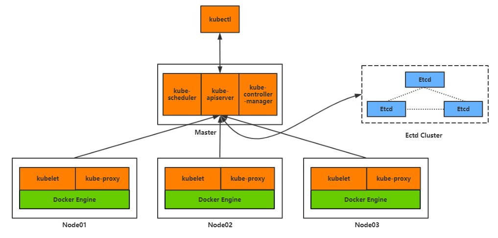
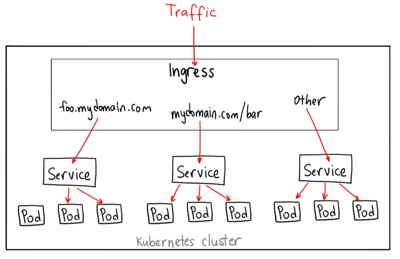

# k8s 简介
kubernetes 是Google开源的编排工具，用于管理和维护容器让容器化应用更高效部署


# K8s 整体架构


# k8s 主要组件和功能作用


## 主要组件
- apiserver   
    暴露了对外提供服务的API，供界面操控K8S,k8s api doc (https://kubernetes.io/docs/concepts/overview/kubernetes-api/)

- etcd    
   用于Kubernetes的后端存储。所有集群数据都存储在此处,它是一个高可用的k-v数据库，内部采用raft协议
   [raft算法参考这里](https://cizixs.com/2017/12/04/raft-consensus-algorithm/）作为一致性
   算法,它是基于GO语言实现，在命令行可以通过命令查看etcd存储的数据，它存储的结构有点类似于文件存储系统，是树结构，可以通过etcdctl查看  `etcdctl get / --prefix --keys-only` 这里是etcd官网(https://etcd.io)

- controller manager    
   作为集群内部的管理控制中心，负责集群内的Node、Pod副本、服务端点（Endpoint）、命名空间（Namespace）、服务账号（ServiceAccount）、资源定额（ResourceQuota）的管理，当某个Node意外宕机时，Controller Manager会及时发现并执行
   自动化修复流程，确保集群始终处于预期的工作状态。它包含一系列controller.例如如下：


```
    Replication Controller
    Node Controller
    CronJob Controller
    Daemon Controller
    Deployment Controller
    Endpoint Controller
    Garbage Collector
    Namespace Controller
    Job Controller
    Pod AutoScaler
    RelicaSet
    Service Controller
    ServiceAccount Controller
    StatefulSet Controller
    Volume Controller
    Resource quota Controller

```

- scheduler   
    资源调度，按照预定的调度策略，将pod调度到对应的机器上
- kubelet   
    负责维护容器的生命周期，负责卷和网络的管理
- container runtime     
   负责镜像管理及pod和容器的真正运行
- kube-proxy    
   负责为server提供集群内部的服务发现和负载均衡


## 主要功能

### 自动伸缩 HDP    
可以在编排中配置HPA横向扩展，可设置最小副本数和最大副本数，k8s可以可以根据ＣＰＵ或者内存自动控制副本数量,例如编排如下

```yaml
apiVersion: autoscaling/v1.0
kind: HorizontalPodAutoscaler
metadata:
  name: my-app  # 名称
  namespace: default #k8s命名空间
spec:
  maxReplicas: 10  # 最大副本数
  minReplicas: 3   # 最小副本数
  scaleTargetRef:   
    apiVersion: apps/v1.0
    kind: Deployment  
    name: ms-wechat   # 监控名为ms-wechat的Deployment
  targetCPUUtilizationPercentage: 80  # cpu 阈值
```

### 卷挂载   
>k8s支持多种类Volume类型挂载，类型如下,具体配置看业务场景,官网地址[volume类型介绍](http://docs.kubernetes.org.cn/429.html)    
```
🔶emptyDir-------生命周期和pod一致，pod被删除时候,数据将被永久删除
🔶hostPath-------将主机上目录挂载到pod中,当pod需要使用主机文件可以使用该类型
🔶gcePersistentDisk----   
  可以挂载GCE上的永久磁盘到容器，需要k8s运行在GCE的VM中。与不同，Pod删除时，gcePersistentDisk被删除，但P内容任然存在。
  这就意味着gcePersistentDisk能够允许我们提前对数据进行处理，而且这些数据可以在Pod之间“切换”。使用gcePersistentDisk，
  必须用gcloud或使用GCE API或UI 创建PD
🔶nfs
Kubernetes中通过简单地配置就可以挂载NFS到Pod中，而NFS中的数据是可以永久保存的，同时NFS支持同时写操作。Pod被删除时，Volume被卸载，
内容被保留。这就意味着NFS能够允许我们提前对数据进行处理，而且这些数据可以在Pod之间相互传递。
🔶awsElasticBlockStore
🔶iscsi
🔶fc (fibre channel)
🔶flocker
🔶glusterfs
🔶rbd
🔶cephfs
🔶gitRepo
🔶secret
🔶persistentVolumeClaim
🔶downwardAPI
🔶projected
🔶azureFileVolume
🔶vsphereVolume
🔶azureDisk
🔶Quobyte
🔶PortworxVolume
🔶ScaleIO
🔶StorageOS
🔶local
```

### 负载均衡    
`ClusterIP` `NodePort` `LoadBalancer` `Ingress`
他们都是将外部流量引入集群的方式,只是完成的方式不同
具体解析参考 [NodePort vs LoadBalancer vs Ingress](https://habrahabr.info/administration/system-administration/1982-kubernetes-nodeport-vs-loadbalancer-vs-ingress-when-and-what-to-use.html)

- ClusterIP   
 外部无法访问，仅仅供集群内部访问，不需要对外提供服务例如内部之间RPC服务可以采用该模式
编排如下

```yaml
apiVersion: v1
kind: Service
metadata:
name: my-internal-service
spec:
selector:
app: my-app
type: ClusterIP
ports:
- name: http
port: 80
targetPort: 80
protocol: TCP
```


- NodePort    
见名知意，集群中开始端口，端口在集群中是唯一的，将该端口上的流量
转到集群内,每个端口对应一个服务,端口范围30000-32767    

      
yaml编排如下    
```yaml
apiVersion: v1
kind: Service
metadata:
name: my-service
spec:
selector:
app: my-app
type: NodePort
ports:
- name: http
port: 80
targetPort: 80
nodePort: 30023
protocol: TCP
```

- LoadBalancer     
LoadBalancer 服务是暴露服务到 internet 的标准方式。在 GKE 上，这种方式会启动一个 Network Load Balancer[2]，它将给你一个单独的 IP 地址，转发所有流量到你的服务。   
   

- Ingress   
ngress 事实上不是一种服务类型。相反，它处于多个服务的前端，扮演着“智能路由”或者集群入口的角色。
你可以用 Ingress 来做许多不同的事情，各种不同类型的 Ingress 控制器也有不同的能力。
GKE 上的默认 ingress 控制器是启动一个 HTTP(S) Load Balancer[3]。它允许你基于路径或者子域名来路由流量到后端服务。例如，你可以将任何发往域名 foo.yourdomain.com 的流量转到 foo 服务，将路径 yourdomain.com/bar/path 的流量转到 bar 服务。     



### 服务发现


### 滚动更新

### 服务编排

### 资源监控

### 提供认证和授权
